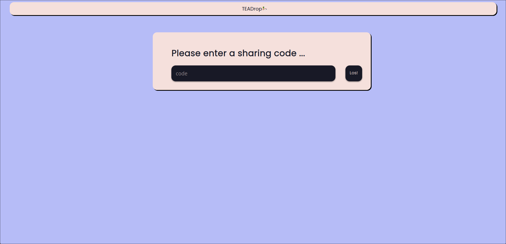
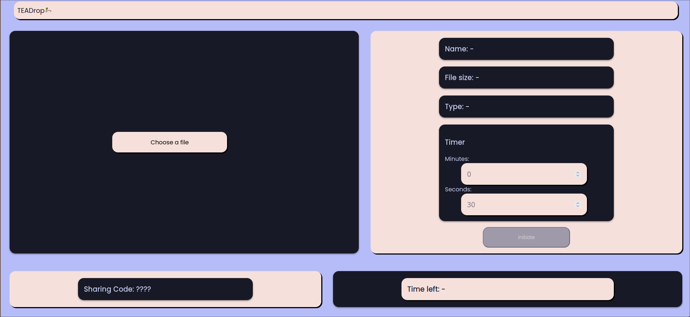

# teadrop

Teadrop is a web based sharing tool, that lets you share files between all operating systems, with up to date browsers.

It`s build using NodeJS as a backend and Jquery for backend and client communication.

## Gallery
* Receive page

* Share page

## Installation
We currently only provide official support for linux based OSs. If you want to use windows this next few steps may differ.

### Dependencies
Download the required native dependencies from your repos:
* nodejs
* npm
* git
* webserver (optional)

Clone the git repo using:

``git clone https://github.com/computer-leadership-poet/teadrop``

Now install all necessary Npm packages with this command:

``
npm install
``
### Configuration an setup
The default port is 3000. It can be modified in line 6 of the app.js

Now you can simply start the server using ``node app.js`` in the project dir.
The website will be available at 127.0.0.1:{your port}

If you need an imprint for your site just fill out imprint_example.html in the public/page folder and rename it to imprint.html 

If you do not need an imprint and just want to test the software, just leave it as it is and rename the file like above, so NodeJs doesn`t crash 😉.

To assign a domain simply create a reverse proxy for your port.

## NOTICE
We do not take any responsibility for files transferred using our code, use on your own risk.
Transferred files aren't being encrypted at any time. We don't have the time and recources to implement encryption, if you have experience and would like to help us, look at the "Contributing" section!

## Contributing
If you find an error, feel free to create an issue on Github.
Otherwise you can always create a PR to improve our janky code 😉, or add new features.
